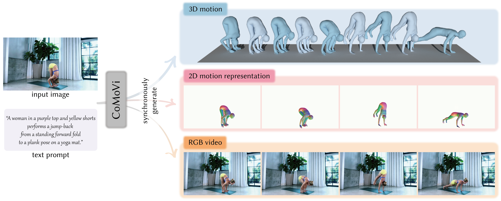

<link rel="stylesheet" href="https://cdnjs.cloudflare.com/ajax/libs/font-awesome/6.5.1/css/all.min.css" integrity="sha512-DTOQO9RWCH3ppGqcWaEA1BIZOC6xxalwEsw9c2QQeAIftl+Vegovlnee1c9QX4TctnWMn13TZye+giMm8e2LwA==" crossorigin="anonymous" referrerpolicy="no-referrer" />

<h1 align="center">CoMoVi: Co-Generation of 3D Human Motions<br>and Realistic Videos</h1>

<p align="center">
  <a href="https://afterjourney00.github.io/" target="_blank">Chengfeng Zhao</a><sup>1</sup>,
  <a href="https://github.com/Samir1110" target="_blank">Jiazhi Shu</a><sup>2</sup>,
  <a href="https://knoxzhao.github.io/" target="_blank">Yubo Zhao</a><sup>1</sup>,
  <a href="https://scholar.google.com/citations?hl=en&user=nhbSplwAAAAJ" target="_blank">Tianyu Huang</a><sup>3</sup>,
  <a href="https://scholar.google.com/citations?hl=en&user=nhbSplwAAAAJ" target="_blank">Jiahao Lu</a><sup>1</sup>,
  <br>
  <a href="https://scholar.google.com/citations?hl=en&user=nhbSplwAAAAJ" target="_blank">Zekai Gu</a><sup>1</sup>,
  <a href="https://scholar.google.com/citations?hl=en&user=nhbSplwAAAAJ" target="_blank">Chengwei Ren</a><sup>1</sup>,
  <a href="https://frank-zy-dou.github.io/" target="_blank">Zhiyang Dou</a><sup>4</sup>,
  <a href="https://chingswy.github.io/" target="_blank">Qing Shuai</a><sup>5</sup>,
  <a href="https://liuyuan-pal.github.io/" target="_blank">Yuan Liu</a><sup>1 <i class="far fa-envelope"></i></sup>
</p>
<p align="center">
  <sup>1</sup>HKUST &nbsp;&nbsp;
  <sup>2</sup>SCUT &nbsp;&nbsp;
  <sup>3</sup>CUHK &nbsp;&nbsp;
  <sup>4</sup>MIT &nbsp;&nbsp;
  <sup>5</sup>ZJU &nbsp;&nbsp;
  <br>
  <i><sup><i class="far fa-envelope"></i></sup> Corresponding author</i>
</p>
<p align="center">
  <a href="https://igl-hkust.github.io/CoMoVi/"></a>
  <a href='https://igl-hkust.github.io/CoMoVi/'></a>
  <a href='https://huggingface.co/datasets/AfterJourney/CoMoVi-50K'></a>
</p>

<div align="center">
  
</div>

## 🚀 Getting Started

### 1. Environment Setup

```bash
conda create python=3.10 --name comovi
conda activate comovi

# basic installation
pip install torch==2.5.0 torchvision==0.20.0 torchaudio==2.5.0 --index-url https://download.pytorch.org/whl/cu121
pip install -r requirements.txt

# install flash attention
pip install ninja
pip install flash_attn --no-build-isolation # ==2.7.3 for CUDA < 12

# install pytorch3d
conda install -c fvcore -c iopath -c conda-forge fvcore iopath
pip install "git+https://github.com/facebookresearch/pytorch3d.git@stable"

# install camerahmr
bash scripts/install_camerahmr.sh
```

### 2. Download Model Weights

```bash
bash scripts/download_model_weights.sh --source modelscope
# or
bash scripts/download_model_weights.sh --source huggingface
```

### 3. Inference

```bash
python inference.py \
  --arch Wan2.2-TI2V-5B \
  --fps 16 \
  --frames 81 \
  --height 704 \
  --width 1280 \
  --interaction "single_m2v" \
  --interleave 1
```

Explanation of arguments:

- `arch`: model architecture of VDM backbone
- `fps`: frame rate of generated video, default is `16`
- `frames`: frame num of generated video, default is `81`
- `height`: `H` of generated video, default is `704`
- `width`: `W` of generated video, default is `1280`
- `interaction`: direction of ControlNet-module, default is `single_m2v` (only motion branch to rgb branch)
- `interleave`: copy one DiT block per `x` pretrained rgb blocks, default is `1` (full copy)

Check inference inputs and outputs in `./example/inference/`:

<table border="0" style="width: 100%; text-align: left; margin-top: 20px;">
  <tr>
      <td>
          <b>motion keyword: high plank</b>
      </td>
      <td>
          <b>motion keyword: dog pose</b>
      </td>
  <tr>
      <td>
          <video src="./assets/example_output_high_plank.mp4" width="100%" controls preload loop></video>
      </td>
      <td>
          <video src="./assets/example_output_dog_pose.mp4" width="100%" controls preload loop></video>
      </td>
  <tr>
</table>


## 🔬 Training

### 1. Data Preparation

<details>
  <summary>Option-1: Download CoMoVi dataset (coming soon)</summary>
  
</details>


<details open>
  <summary>Option-2: Pepare customized data step by step</summary>
  
  #### Install [Blender](https://www.blender.org/)
  ```bash
  mkdir <dir_for_blender>
  cd <dir_for_blender>

  wget https://download.blender.org/release/Blender3.6/blender-3.6.0-linux-x64.tar.xz
  xz -d blender-3.6.0-linux-x64.tar.xz
  tar -xvf blender-3.6.0-linux-x64.tar

  export PATH=<dir_for_blender>/blender-3.6.0-linux-x64:$PATH
  ```
  
  #### Step-1: Estimate human motion from image frames
  ```bash
  python -m prepare.step1_run_hmr
  ```

  #### Step-2: Smooth framewise motion estimation
  ```bash
  python -m prepare.step2_smooth
  ```

  #### Step-3: Render 3D human motion to 2D motion representation
  ```bash
  python -m prepare.step3_render_2d_morep
  ```

  #### Step-4: Normalize data to the native setting of Wan2.2 (e.g. resolution, fps, etc.)
  ```bash
  python -m prepare.step4_normalize
  ```

  After the steps above, the `./examples/training/` folder should be in the following structure:
  ```bash
  examples/training/
  ├── CameraHMR_smpl_results/           # raw HMR results
  └── CameraHMR_smpl_results_overlay/   # raw HMR re-projection results for sanity check
  └── CameraHMR_smpl_results_smoothed/  # smoothed HMR results
  └── motion_2d_videos/                 # rendered 2d motion representation video
  └── processed_trainable_data/         # training-ready data 
  └── rgb_videos/                       # rgb video 
  ```

  #### Step-5: Caption description of human motion in videos
  We caption videos using enterprise-level api of Gemini-2.5-pro. To get similar results using open-source models, we tested [Qwen-VL](https://github.com/QwenLM/Qwen3-VL?tab=readme-ov-file#using--transformers-to-chat) and [DAM](https://github.com/NVlabs/describe-anything#detailed-localized-video-descriptions). Please follow their example codes.

  #### Step-Final: Organize everything in a data config file
  Make a JSON file to list the training corpus, [for instance](./config/data/example_training.json):
  ```json
  [
    {
      "rgb_path": "example/rgb.mp4",
      "motion_path": "example/motion.mp4",
      "first_frame": "example/first_frame.jpg",
      "motion_first_frame": "example/motion_first_frame.jpg",
      "text": "A woman in a red long-sleeved crop top and matching leggings holds a high plank position on a yoga mat.",
      "type": "video"
    },
    {},
    {},
    ......,
    {}
  ]
  ```

</details>


### 2. Train CoMoVi

```bash
# stage 1
bash scripts/train_comovi_stage1.sh <GPU_NUM> <MACHINE_NUM> <LOCAL_RANK> <GPU_IDS> <MAIN_MACHINE_IP>

# stage 2
bash scripts/train_comovi_stage2.sh <GPU_NUM> <MACHINE_NUM> <LOCAL_RANK> <GPU_IDS> <MAIN_MACHINE_IP>

# example command for 2 8-GPU training machines
bash scripts/train_comovi_stage1.sh 16 2 0 0,1,2,3,4,5,6,7 x.x.x.x
bash scripts/train_comovi_stage1.sh 16 2 1 0,1,2,3,4,5,6,7 x.x.x.x
#
bash scripts/train_comovi_stage2.sh 16 2 0 0,1,2,3,4,5,6,7 x.x.x.x
bash scripts/train_comovi_stage2.sh 16 2 1 0,1,2,3,4,5,6,7 x.x.x.x
```

The ZeRO-3 sharded checkpoints will be saved in `./output_dir/`. To convert it to full bf16 model, run:
```bash
python scripts/zero_to_bf16.py {zero3_dir} {target_dir} --max_shard_size 80GB --safe_serialization
```

## Acknowledgments

Thanks to the following work that we refer to and benefit from:
- [VideoX-Fun](https://github.com/aigc-apps/VideoX-Fun): the video generation model training framework;
- [CameraHMR](https://github.com/pixelite1201/CameraHMR/): the excellent SMPL estimation for pseudo labels;
- [Champ](https://github.com/fudan-generative-vision/champ): the data processing pipeline

## Citation

```bibtex
@article{zhao2026comovi,
  title={CoMoVi: Co-Generation of 3D Human Motions and Realistic Videos},
  author={Zhao, Chengfeng and Shu, Jiazhi and Zhao, Yubo and Huang, Tianyu and Lu, Jiahao and Gu, Zekai and Ren, Chengwei and Dou, Zhiyang and Shuai, Qing and Liu, Yuan},
  journal={arXiv preprint arXiv:2601.10632},
  year={2026}
}
```